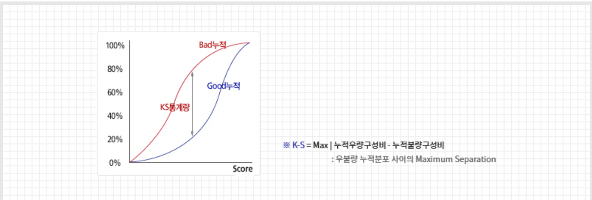
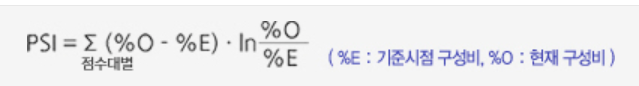
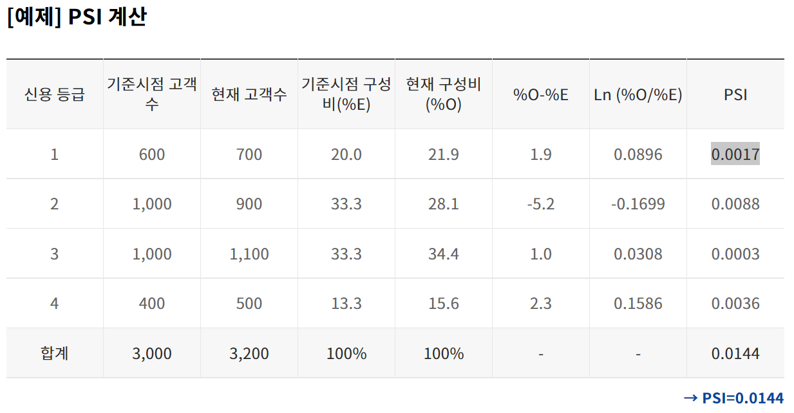

## 은행에서 인정하는 고소득 전문직 종류

- 법조인
  - 판사
  - 검사
  - 변호사
- 의료인
  - 의사
  - 치과의사
  - 한의사
- 법무관련 전문직
  - 변리사
  - 법무사
  - 공인노무사
  - 손해사정사
  - 행정사
- 회계관련 전문직
  - 공인회계사
  - 세무사
  - 관세사
- 학자/교육자
  - 4년제 대학 교수(정/부/조교수)
- 기술관련 전문직
  - 기술사
  - 도선사
  - 건축사
- 부동산 관련 전문직
  - 감정평가사
- 약사
- 수의사
- 보험계리사

## 전문직 관련 조사자 데이터

http://datakorea.datastore.or.kr/profile/job/J2/

http://laborstat.moel.go.kr/hmp/main/tblInfoUnitySearch.do#

서울시 학력 데이터 - https://data.seoul.go.kr/dataList/423/S/2/datasetView.do

https://kess.kedi.re.kr/index : 테마통계>주요지표>대학통계

## 전문직 구분?

전문직만이 보이는 패턴이 있을것 - 무엇

인방충들과의 차이 - 일정한 소득 

# 신용평가 모델 생성

* 해외 신용평가 모델 및 데이터를 활용해 우리나라에 맞춘 신용평가 모델 생성
* 어떤 전문직에서 상위 몇퍼센트인지 / 출신 등을 요소에 넣어서

MIS Management information system 에 대해 알아야 하구요probability and loss, PL(portfolio, single account &L)MIS에서 선행지표 동행지표 후행지표가 있는데, 거기에서, 경기상황을 볼 때, 경기지표 해석할 때도, 경기선행, 경기동행, 경기후행지표에 따라 주식, 채권 등 판단하는 건데 이런 거에 대한 지식도 조금 필요하구요

## 도메인 지식 구축

1. MIS(Management imformation system)

   * 기업이라는 시스템의 관점에서 경영시스템의 목표인 이익창출을 위해 다른 하위 시스템을 효율적으로 작용하도록 지원하는 시스템

   * MIS는 주로 다음과 같은 목적에서 도입된다
     1. 운영 효율성 : 기업 운영의 효율성을 개선하여 생산성을 증대시킨다
     2. 새로운 비즈니스 모델 : 새로운 상품, 서비스, 비즈니스 모델을 창출할 수 있다
     3. 고객-공급자 친밀성 : 고객의 요구에 즉각적으로 반응할 수 있고, 잠재적 요구까지 분석해낼 수 있다
     4. 의사결정 지원 : 정보부족으로 인해 단순 예측과 운에 의지하던 의사결정을 보다 확실하게 할 수 있도록 돕는다
     5. 경쟁우위 : 더 싸고 더 좋고 더 빨리 대응할 수 있다
     6. 생존 : 기업의 생존에 필수적인 요소가 되기도 한다

2. 선행지표 / 후행지표 / 동행지표

   * 선행지표 : 미래성과에 영향을 미치는 현재과정에 투입되는 조치를 측정할 수 있는 지표
     * 예시) 위험기계의 유지관리 수준, 변경관리 수준
   * 후행지표 : 과거 조치들에 기인된 결과를 측정할 수 있는 지표
     * 예시) 재해율, 강도율
   * 동행지표 : 

3. Probability and Loss, PL(portfolio, single account & L)

4. Score

   1. 신청평점(Application score, ass) :  대출 기관이 신용 신청 양식에 제공된 정보를 기반으로 적절한 고객을 받아들이는 데 사용하는 점수 유형
   2. 행동평점(Behavior score, bss) : 일부 신용 카드 발급자가 신용 조사 기관에서 구매 한 신용 점수를 보완하기 위해 사용하는 내부 독점 점수 시스템
   3. 채권추심평점(Collection score) : 추심에있는 해당 계정에 대한 미결제 잔액의 회수 가능성을 정량화합니다. 추심 스코어 카드는 채무자의 지불 의사와 지불 능력을 통계적으로 추정하므로 추심을 늘리기 위해 어떤 조치를 취해야하는지 정의하는 데 도움이됩니다.
   4. 대손회수평점(Recovery score) : 대손이란 외상매출금, 받을어음 등의 수취채권을 채무자의 파산 등의 이유로 받지 못하게 되는 것
   5. 파산예측평점(Bankruptcy prediction score)

5. Score 분석 보고서 

   1. KS보고서

      1. K-S 통계량은 우량집단과 불량집단의 누적분포의 차이를 나타내는 지표로 신용평가모형의 변별력 평가 시 주요 판별 통계량으로 활용됩니다.
         K-S 통계량이 20 이상인 경우 신용평가모형의 변별력이 확보되는 것으로 판단합니다.
      2. 신용등급에 따른 우불량 집단의 분포 차이를 비교하여, 누적 우량비율과 누적 불량비율 차이의 최대 값을 K-S 통계량으로 정의합니다.

      

   2. PSI보고서

      1. PSI는 모집단의 안정성을 나타내는 지수로, 기준시점 대비 현재 분포의 차이를 나타내며 수치가 클수록 모집단의 변화가 크다는 것을 의미합니다.

      

      

6. 신용정보 (영국 experian사의 cii, 미국 fico의 cci 등 참고)

   1. 예측력(prediction)
   2. 커버리지(coverage)
   3. 적시성(timeliness)
   4. 각 회사들의 보고서들도 직접 사람들을 고용해서 공공정보자료, 고용, 거주이력, 자산소유, 파산, 등에 대한 정보를 바탕으로 보고서를 작성

## ㅇㅇ

정확도를 높이고 리스크보다는 수익성에 초첨을 맞춤

# 11

고소득보단, 그냥 제가 어제 생각했던 대로,자본소득보다. 노동소독이 큰 사람들을 위주로 생각하면 됩니다네 맞아요 그러면,건물주를 제외하고, 의사, 변호사 그런사람들을파악할 수 있게됩니다물론 하나변수로만 따질 수 는 없지요,

전문직은 사전적으로만 생각하면, 전문적인 자격증을 보유한 사람으로 생각하기 쉬운데, 제가 의견을 피력한 자존심이 강한 사람들은 주로, 학력에 따른 그리고 특히, 의사나 변호사, 변리사 이러한 자격증을 가진 사람들을 타켓으로 한 것이어서, 그런 사람들은 일반적으로, 평균중위소득을 데랴와도 보통사람보다 앞도적으로 높기 때문에, 노동소독으로 하면 경향이 매우 예측력이 높을 것으로 생각했습니다.

의사로 한정을 시키면, 자본설비를 가진 사람들중 의료기기랑, 간호사 간호조무사 비용으로 돈을 많을 소비하는 사람으로 규정하면 그렇게 알 수 있고,은행데이터에서 제공하는 소비자 금융데이터 중 지출비용을 저희가 확인해야할 것 같습니다재무재표를 보면 현금흐름이 어떻게 진행되는지, 유동, 비유동자산이 어떻게 변하는 지만 파악이 되는데, 소비자 금융자료를 신한은행, 국민은행이 무료로 제공하니까,네 있습니다.

자존심은 세금관련 변화나 자격증 수 조절에 따른 집단행동의 여부로 알 수 있을 것 같아요.예를들어 변호사협회나 의사협회는 의대수를 늘리려고 하면,인풋이 많으면 밥그릇이 적으니까 적극반대하고공인중계사, 주택관리사도 자격증으로 인한 것인데도 반발을 안하는데, 의사협회나 변호사협회는 여기 되게 민감하고ㅓ세금은 잠시만요세금관련 변화는, 세금변화에 따른 공급탄력성의 변화를 일컫는데요, 다른 직업에 비해, 세금을 조금이라도 변화시키면, 공급을 크게 줄이거나 늘리는 직업이 주로, 변호사 의사들입니다. 이 자료들은 주로 미국에서 그렇게 데이터들이 쌓여있습니다세금은, 자본에 돈을 매기는 세금이있고, 소득에 세금을 매기는 소득세가 있는데, 전문직은 소득세에 되게 민감하거든요., 노동시장 맞습니다.

네 그부분도 그렇게 생각할 수 있습니다.예를들어, 서울대 출신은 사회적으로 유리하기 때문에, 세금을 200% 더 낸다라고 하면 , 서울대를 안가고 연고대로 몰리지 않을까요?연고대에는 세금150% 추가 소득세 납부 이렇게하고, 한다면 연고대도 , 안가고 사람들이 자동반납을 할 것 같습니다.그 아이디어도 좋은 것 같습니다구체적인 단어에대해 계속 분석하면, 같은 단어에 대해 반대되는 결과를 내릴 수 있으니까

네 괜찮은 아이디어ㅗ 입니다학력은 대학원졸이나, 박사학위 이상소지자에 대한 자료는 구할 수 있지 않을까요?youtube 같은 플랫폼으로 돈을 버는 초고소득자는 승자독식으로 가는 거라연예인도 유재석이나 그런사람들 빼고는매우 적은 사람들만 돈을 잘버는 구조니까, 직업별로 중위소득으로 대표성을 설정하면의사 상위50% 랑 , 회사원 상위50%랑 비교하면,의사는 상위50%가 통계청에서 볼 수 있는 자료로 세전 890만원 안팎인데,일반 회사원은 250만원 전후라서,youtube 나 인스타그램 이런 수퍼인플루언서들도, 소수를 제외하고, 중위소득으로 생각하면, 충분히 의미있게 변별할 수 있지 않을까 생각이듭니다

그부분에 대해 생각을 해보고, 어떤 자료로 매칭을 시킬 지 생각을 해보아야겠네요대학원졸은 자료를 구하기 쉬운데, 상위대학은 자료를 찾기 어려우니까네 출신대학 추적은 힘든데,대부분 설문지에, 대학원 졸 박사이상 이런 설문은 많이 진행된게 많으니까네데이터를 먼저 찾아보고 구하기 쉬운거로 좁히는게 좋을 것 같습니다

저는 이 데이터를 찾앗는데 이것은 인천시 데이터입니다. 

https://www.data.go.kr/data/15076577/fileData.do

직종별 데이터는 여기 있습니다

https://www.data.go.kr/tcs/dss/selectDataSetList.do?dType=TOTAL&keyword=%EC%86%8C%EB%93%9D+%EC%A7%81%EC%A2%85%EB%B3%84&detailKeyword=&publicDataPk=&recmSe=&detailText=&relatedKeyword=&commaNotInData=&commaAndData=&commaOrData=&must_not=&tabId=&dataSetCoreTf=&coreDataNm=&sort=&relRadio=&orgFullName=&orgFilter=&org=&orgSearch=&currentPage=1&perPage=10&brm=&instt=&svcType=&kwrdArray=&extsn=&coreDataNmArray=&pblonsipScopeCode=1_

전문직을 판별할 수 있는 변수1. 세금2. 연령3. 노동시간4. 소득의 지출

소득인식분포는 데이터가 서울시 데이터가 꽤 있습니다https://data.seoul.go.kr/dataList/datasetList.do#https://www.data.go.kr/data/15066762/fileData.do

https://www.experian.com/blogs/ask-experian/how-to-learn-more-about-credit/여기서 관련데이터를 얻는 방법이 있어요.

## 정보제공사이트

* 마이크로데이터 : https://mdis.kostat.go.kr/index.do
* 통계청 : https://kostat.go.kr/portal/korea/index.action
* 서울시 빅데이터 캠퍼스 : https://bigdata.seoul.go.kr/main.do
* 국가통계포털 : https://kosis.kr/index/index.do
* e나라지표 : https://www.index.go.kr/main.do?cate=1
* 서울열린데이터광장 : https://data.seoul.go.kr/
* 공공데이터포탈 : https://www.data.go.kr/

* 금융데이터 : https://www.fsc.go.kr/in060301

전문직 여부와 계층에 관한 변수가 리스크관리시에 신용평점과 스코어에 어느정도 예측성, 적시성, 등의 변수에 영향을 주는 지 계량적으로 분석

신용리스크관리에서 스코어링 모델

문제인식: 현재 한국의 은행 등에서 개인의 대출상환능력을 평가하는 기준(신용평점)은다른 나라의 평가기준(신용리스크관리에서 스코어링 모델 등)에 비해 그 예측성과 적시성 등이 뒤처짐.

연구: 전문직 여부와 학력 변수가개인의 대출상환능력을 평가하는 기준에 얼마나 영향을 미치는지 분석
도출하고자 하는 해결: 전문직 여부와 학력 변수를 고려하여개인의 대출상환능력을 평가하는 개선된 기준안 마련.
활용 주체: 금융기관(은행, 보험업, 신용카드)에서 개인 대상의 금융 상품(소비자금융) 제공 시 고객의 신용리스크를 관리할 때 활용 가능.

전문직을 판별하는 기준으로 사용할 변수0. 소득수준1. 세금2. 연령3. 노동시간4. 소득의 지출
학력변수- 중학교졸, 고등학교졸, 대학교졸, 석사, 박사, ...
리스크 관리에 활용할 변수?소득, 연령, 대출, 직장인 여부, 연체여부, ...

1_최원희2님이 모두에게: 03:51 PMhttps://mdis.kostat.go.kr/infoData/detailData.do?statsConfmNo=1010041_최원희2님이 모두에게: 03:58 PMhttps://openapi.work.go.kr/opi/opi/opia/jobSrchVw.do
지능본질과 구현

벤치마킹하기는 좋은데, 신용스프레드나 그런 용어들 때문에 겁먹을 수 있는데, 국체랑 회사체 가격차이가 정의이고, 그게 의미하는 바는 뭐인지 등등은 네이버 검색해도 설명 잘 나와있어요아니면, 최진기의 경제바다에 빠져라, 뭐 그런 책 잠깐 빌려봐도, 관련된 경제나 금융 단어들 하루면 정리할 수 있어요!